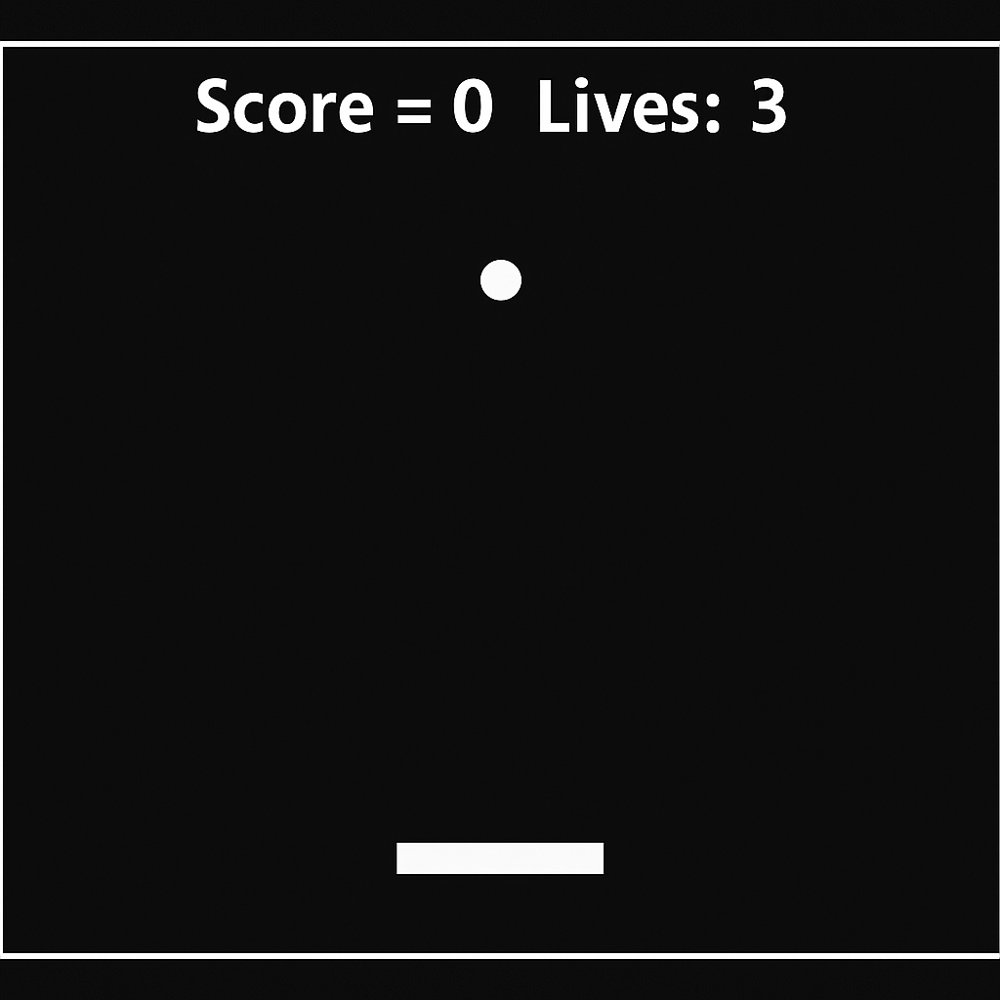

# Pong Game with OOPs

This is a simple Pong game implemented using **SFML** and **Object-Oriented Programming (OOP)** principles. The game features a paddle (bat) and a ball, with collision detection and scoring mechanics.

  

## Features

- **Object-Oriented Design**:
  - The `Bat` and `Ball` are implemented as separate classes with encapsulated properties and methods.
  - Classes include methods for movement, collision handling, and updates.

- **SFML Integration**:
  - Utilizes SFML for rendering graphics, handling input, and managing game loops.

- **Game Mechanics**:
  - Paddle movement using arrow keys.
  - Ball rebounds from walls, paddle, and top.
  - Score and lives tracking.
  - Game over condition when lives reach zero.

## How to Run

1. Install **SFML** on your system.
2. Compile the project using a C++ compiler with SFML linked.
3. Run the executable to play the game.

## File Structure

- `OurCompletePongWithOOPs.cpp`: Main game logic and rendering.
- `ourBat.cpp` and `ourBat.h`: Implementation of the `Bat` class.
- `ourBall.cpp` and `ourBall.h`: Implementation of the `Ball` class.

## Controls

- **Left Arrow**: Move the paddle left.
- **Right Arrow**: Move the paddle right.
- **Escape**: Exit the game.

Enjoy playing the game!
###### NOTE This game was developed as a semester project during the Game Development module in our Computer Science syllabus

